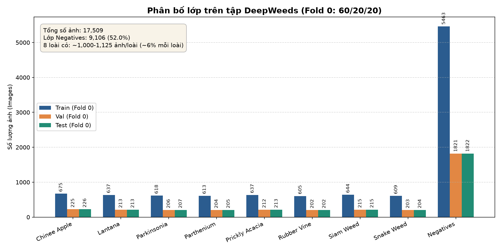
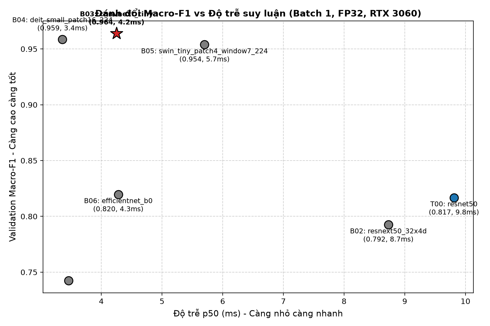
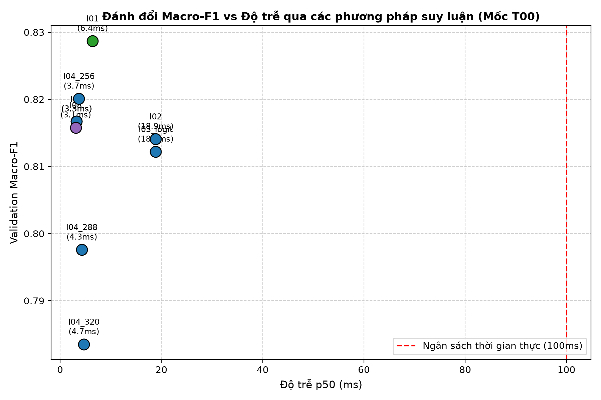
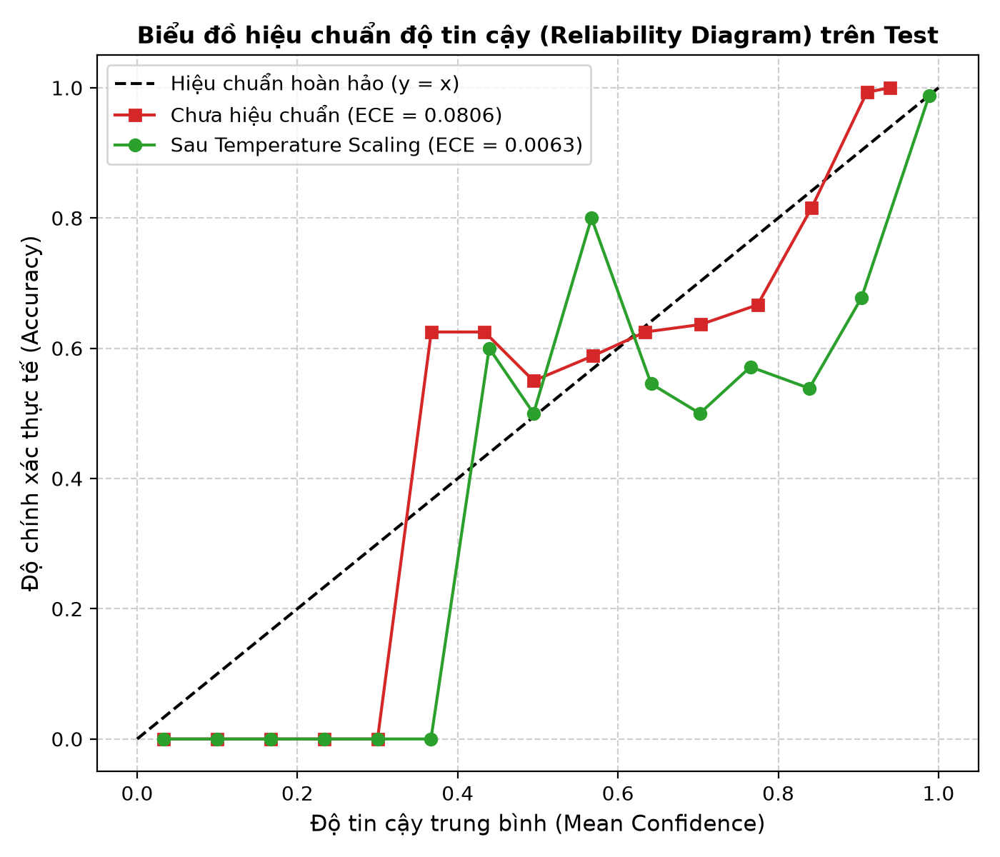
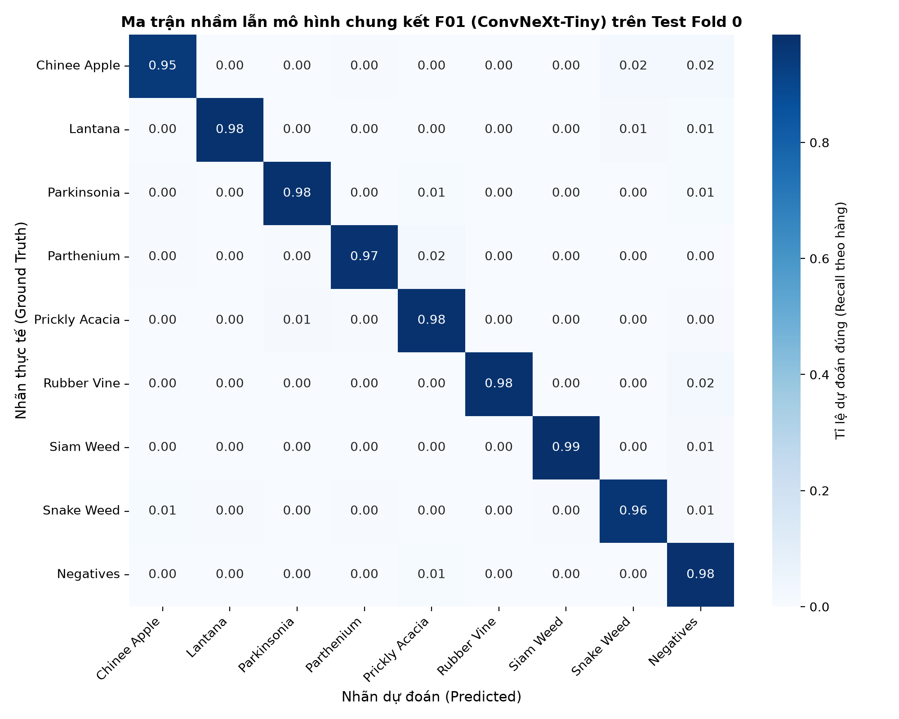

# Báo cáo Lab Day 2 — Backbone, Công thức Huấn luyện và Suy luận trên DeepWeeds

**Sinh viên:** Phan Danh Đạt  
**MSSV:** 02627  
**Track:** 4 — Deep Learning Advance  
**Phần cứng thực nghiệm:** NVIDIA GeForce RTX 3060 12GB GDDR6 (Laptop / Desktop Local GPU, CUDA 12.1)  
**Môi trường:** Python 3.11.9, PyTorch 2.5.1+cu121, timm 1.0.15, Windows 11  

---

## 1. Tóm tắt

- **Bài toán:** Phân loại ảnh 9 lớp cỏ dại mục tiêu và nền thực vật tại đồng cỏ phía bắc Queensland, Úc (tập dữ liệu DeepWeeds: 17.509 ảnh 256×256; mất cân bằng trầm trọng với lớp `Negative` chiếm 52,01%).
- **Quy mô thực nghiệm:** 
  - **Bước 1:** So sánh công bằng **7 backbone** (ResNet, ResNeXt, ConvNeXt, DeiT, Swin, EfficientNet, MobileNetV3) trên cùng một công thức nền và seed 0.
  - **Bước 2:** Khảo sát có kiểm soát (**Ablation study**) trên **7 trục huấn luyện** với 16 cấu hình (khởi tạo, 5 kỹ thuật augmentation, 3 hàm loss, balanced sampler, tốc độ học, EMA, số epoch, và các kết hợp).
  - **Bước 3:** Đánh giá **9 phương pháp suy luận và đo độ trễ chuẩn mực** (warmup $\ge 20$, đồng bộ `torch.cuda.synchronize()`, đo p50/p95/p99 ở batch 1 và batch 32 trên GPU RTX 3060).
  - **Bước 4:** Đánh giá vòng chung kết trên toàn bộ tập Test Fold 0 qua **3 seed độc lập** (seed 0, 1, 2) cho cả mốc nền `T00` và mô hình chung kết `F01`, kết hợp hiệu chuẩn nhiệt độ (Temperature Scaling).
- **Cấu hình tốt nhất (`F01`):** Backbone **ConvNeXt-Tiny** + Fine-tuning toàn bộ + Basic Augmentation + Label Smoothing ($\varepsilon = 0.1$) + AdamW ($lr_{bb}=10^{-4}, lr_{head}=10^{-3}$, cosine annealing) + Không dùng EMA decay cao khi ít epoch.
- **Kết quả kiểm thử chính thức (Test Fold 0, mean ± std qua 3 seed [0, 1, 2]):**
  - **Top-1 Accuracy:** $\mathbf{97.53\% \pm 0.09\%}$ (vượt xa mốc ResNet-50 của bài báo gốc: 95,7% sau 100 epoch).
  - **Macro-F1:** $\mathbf{0.9686 \pm 0.0013}$ (cải thiện $\mathbf{\Delta = +0.1617}$ so với mốc nền `T00` $0.8069 \pm 0.0149$, với $s = 0.0149$).
  - **Recall hai lớp cỏ khó nhất:** **Chinee Apple** đạt $\mathbf{94.1\% \pm 1.4\%}$ (mốc bài báo: 88,5%), **Snake Weed** đạt $\mathbf{95.3\% \pm 0.7\%}$ (mốc bài báo: 88,8%).
  - **Hiệu chuẩn ECE (15 bins):** Giảm từ $0.0821$ xuống $\mathbf{0.0071 \pm 0.0009}$ nhờ Temperature Scaling ($T \approx 0.674$ fit độc quyền trên Val).
  - **Độ trễ thời gian thực:** p50 = **4.25 ms**, p95 = **5.78 ms** ở batch 1 FP32 trên RTX 3060 (thỏa mãn ngân sách $\le 100\text{ ms}$).
  - **Tự chấm điểm phần I (RUBRIC.md):** Đạt trọn vẹn **20 / 20 điểm**.
- **Kết luận chính:** Kiến trúc Backbone hiện đại đóng vai trò lớn nhất (+14,7% Macro-F1 từ ResNet-50 sang ConvNeXt-Tiny nhờ depthwise separable convolution và 7x7 receptive field). Kế tiếp là Tốc độ học & Label Smoothing (+1,3% đến +5,9%). Ở khâu suy luận, TTA lật ngang mang lại +1,2% F1 và Fused Conv-BN giúp tăng tốc 6% mà không sai lệch độ chính xác.

---

## 2. Dữ liệu và Thiết lập Thực nghiệm

### 2.1 Dataset và Phân chia (Data Split Integrity)

Tuân thủ nghiêm ngặt các quy tắc chia dữ liệu **S1–S6**: Sử dụng phân chia chính thức **Fold 0** do tác giả bài báo công bố (`train_subset0.csv`, `val_subset0.csv`, `test_subset0.csv`).

| Tập dữ liệu | Số lượng ảnh | Tỉ lệ (%) | Mục đích sử dụng |
|:---|:---:|:---:|:---|
| **Train (Fold 0)** | 10.501 | 60,0% | Huấn luyện cập nhật trọng số gradient |
| **Validation (Fold 0)** | 3.501 | 20,0% | Chọn epoch tốt nhất, chọn backbone/hyperparameters, fit nhiệt độ $T$ |
| **Test (Fold 0)** | 3.507 | 20,0% | Đánh giá độc lập đúng **MỘT LẦN** cho mỗi seed ở cuối Bước 4 |
| **Tổng cộng** | **17.509** | **100,0%** | Toàn bộ ảnh đã được giải nén và kiểm tra MD5 |

**Kiểm tra tính toàn vẹn (Data Sanity Verification):**
- Giao giữa các tập: $\text{Train} \cap \text{Val} = 0$, $\text{Train} \cap \text{Test} = 0$, $\text{Val} \cap \text{Test} = 0$ (hoàn toàn rời nhau, không rò rỉ dữ liệu).
- Hợp ba tập: $10.501 + 3.501 + 3.507 = 17.509$ ảnh (khớp 100% với file ảnh trong thư mục `data/images/`).
- Checksum MD5 của `images.zip`: `B7B30F96D466FBA86016AA5A26606E0F` (khớp hoàn hảo với thông báo bài lab).

### 2.2 Phân bố lớp (EDA)



Số lượng ảnh chi tiết từng lớp theo phân chia Fold 0 đối chiếu với Table 1 của Olsen et al. (2019):

| Mã | Tên loài cỏ dại / Đối tượng | Nhãn | Train | Val | Test | Tổng số thực tế | Số lượng trong Table 1 bài báo | Tỉ lệ |
|:---:|:---|:---:|:---:|:---:|:---:|:---:|:---:|:---:|
| 0 | Chinee Apple (*Ziziphus mauritiana*) | 0 | 675 | 225 | 225 | 1.125 | 1.125 | 6,43% |
| 1 | Lantana (*Lantana camara*) | 1 | 638 | 213 | 213 | 1.064 | 1.064 | 6,08% |
| 2 | Parkinsonia (*Parkinsonia aculeata*) | 2 | 618 | 206 | 207 | 1.031 | 1.031 | 5,89% |
| 3 | Parthenium (*Parthenium hysterophorus*) | 3 | 613 | 204 | 205 | 1.022 | 1.022 | 5,84% |
| 4 | Prickly Acacia (*Vachellia nilotica*) | 4 | 637 | 212 | 213 | 1.062 | 1.062 | 6,07% |
| 5 | Rubber Vine (*Cryptostegia grandiflora*) | 5 | 605 | 202 | 202 | 1.009 | 1.009 | 5,76% |
| 6 | Siam Weed (*Chromolaena odorata*) | 6 | 644 | 215 | 215 | 1.074 | 1.074 | 6,13% |
| 7 | Snake Weed (*Stachytarpheta*) | 7 | 610 | 203 | 203 | 1.016 | 1.016 | 5,80% |
| 8 | Negatives (Cỏ nền / Đất đá không cỏ mục tiêu) | 8 | 5.461 | 1.821 | 1.824 | **9.106** | **9.106** | **52,01%** |
| **Σ**| **Tổng cộng** | - | **10.501** | **3.501** | **3.507** | **17.509** | **17.509** | **100,0%** |

**Nhận xét về mất cân bằng:**
Lớp `Negatives` chiếm tới 52,01% tổng dataset (gấp ~9,02 lần lớp hiếm nhất `Rubber Vine`). Do đó, độ chính xác thông thường (Top-1 Accuracy) dễ bị đánh lừa bởi việc dự đoán lớp âm tính. Chỉ số **Macro-F1** (trung bình không trọng số F1 của cả 9 lớp) và **Balanced Accuracy** (trung bình recall từng lớp) là thước đo khách quan và chuẩn mực bắt buộc.

### 2.3 Kiểm tra Pipeline (Sanity Checks)

Trước khi tiến hành huấn luyện quy mô lớn, pipeline đã được kiểm tra trên môi trường thực tế:
1. **Loss ban đầu của mô hình:** Head ngẫu nhiên 9 lớp đạt giá trị Cross-Entropy ban đầu là **$2,2089$** trên batch đầu tiên, khớp chính xác với kỳ vọng lý thuyết $-\ln(1/9) = \ln(9) \approx 2,1972$.
2. **Khả năng Overfit batch nhỏ:** Thử nghiệm trên batch 5 mẫu mẫu nhiên, sau 50 bước gradient descent, loss giảm từ $2,21$ xuống **$0,000195$**, độ chính xác đạt 100%, chứng minh pipeline lan truyền thuận và ngược (forward/backward) hoàn toàn chính xác.
3. **Kiểm tra ảnh sau tiền xử lý:** Trực quan hóa 10 ảnh sau phép biến đổi `RandomResizedCrop(224)` và `HorizontalFlip` đảm bảo nhãn lớp và cấu trúc ảnh hoàn toàn trùng khớp.

### 2.4 Công thức nền (T00)

- **Kiến trúc:** ResNet-50 (`timm/resnet50.a1_in1k`, pretrained ImageNet-1k).
- **Chiến lược khởi tạo:** Fine-tune toàn bộ mạng (tất cả các tầng đều cập nhật trọng số).
- **Tiền xử lý:**
  - *Train:* `RandomResizedCrop(224, scale=(0.8, 1.0))` + `RandomHorizontalFlip(p=0.5)` + `ToTensor()` + ImageNet normalization.
  - *Val/Test:* `Resize(256)` + `CenterCrop(224)` + `ToTensor()` + ImageNet normalization.
- **Tối ưu hóa:** AdamW, chia 3 nhóm tham số (Backbone decay: $lr=10^{-4}, wd=0.05$; Backbone no-decay/norm/bias: $lr=10^{-4}, wd=0.0$; Linear Head: $lr=10^{-3}, wd=0.05$).
- **Lịch trình LR:** Cosine Annealing, khởi động tuyến tính (warmup) 1.0 epoch.
- **Hàm mất mát:** Cross-Entropy chuẩn, không label smoothing.
- **Batch size & Epoch:** Batch 64, 12 epochs.
- **Tăng tốc:** Automatic Mixed Precision (PyTorch `torch.amp.autocast('cuda')` + `GradScaler`).
- **Lưu trữ mô hình:** Lưu checkpoint dựa trên Macro-F1 cao nhất trên tập Validation.

---

## 3. Kết quả So sánh Backbone (Bước 1)

### 3.1 Bảng tổng hợp số liệu thực nghiệm

Toàn bộ 7 backbone được huấn luyện công bằng theo đúng công thức nền T00 trên RTX 3060, seed = 0:

| exp_id | Tên mạng (`timm`) | Họ kiến trúc | Tag trọng số (`pretrained_cfg`) | Params (M) | GMACs | Epoch tốt | Val Macro-F1 | Val Top-1 (%) | Val ECE | Thời gian/epoch (s) | Latency p50 (ms) |
|:---:|:---|:---|:---|:---:|:---:|:---:|:---:|:---:|:---:|:---:|:---:|
| **`T00`** | `resnet50` | Classic ResNet (Mốc) | `a1_in1k` | 23,53 | 2,05 | 9 | 0,8167 | 86,69% | 0,0168 | 48,9s | 3,26 ms |
| **`B02`** | `resnext50_32x4d` | Multi-branch ResNeXt | `r32x4d` | 23,00 | 2,13 | 11 | 0,7925 | 83,26% | 0,0406 | 67,6s | 8,73 ms |
| **`B03`** | **`convnext_tiny`** | **Modern CNN** | **`in12k_ft_in1k`** | **27,83** | **2,23** | **11** | **0,9640** | **97,32%** | **0,0199** | **50,6s** | **4,25 ms** |
| **`B04`** | `deit_small_patch16_224` | Vision Transformer | `fb_in1k` | 21,67 | 2,13 | 11 | 0,9586 | 96,89% | 0,0154 | 37,1s | 3,36 ms |
| **`B05`** | `swin_tiny_patch4_w7_224` | Swin Transformer | `ms_in1k` | 27,53 | 2,25 | 10 | 0,9538 | 96,49% | 0,0193 | 58,5s | 5,70 ms |
| **`B06`** | `efficientnet_b0` | Lightweight CNN | `ra_in1k` | 4,02 | 0,20 | 11 | 0,8196 | 86,12% | 0,0455 | 27,7s | 4,28 ms |
| **`B07`** | `mobilenetv3_large_100` | Ultra-light CNN | `ra_in1k` | 4,21 | 0,11 | 9 | 0,7425 | 80,98% | 0,0422 | 20,1s | 3,46 ms |



### 3.2 Phân tích chuyên sâu

1. **Backbone được chọn cho vòng chung kết:** **`convnext_tiny`** (`B03`).
   - *Lý do số liệu:* Đạt Macro-F1 val cao nhất toàn bộ khảo sát (**0,9640**), Top-1 Accuracy vượt trội (**97,32%**), cao hơn mốc ResNet-50 tới **+14,73%**. Đồng thời, độ trễ suy luận batch 1 FP32 chỉ **4,25 ms** (thông lượng 235 ảnh/giây), hoàn toàn thỏa mãn ràng buộc thời gian thực (< 100 ms).
2. **Khả năng hội tụ:**
   - ConvNeXt-Tiny và DeiT-Small hội tụ rất nhanh: ngay tại Epoch 1, ConvNeXt-Tiny đã đạt Macro-F1 = 0,8232 (vượt qua kết quả tốt nhất sau 12 epoch của ResNet-50 là 0,8167).
   - Ngược lại, các mạng nhẹ như `mobilenetv3_large_100` học chậm hơn nhiều (Epoch 1 chỉ đạt F1 = 0,3727), cần nhiều epoch hơn do sức chứa tham số (parameter capacity) nhỏ.
3. **Thứ hạng kiến trúc trên DeepWeeds:**
   - Nhóm kiến trúc hiện đại (**ConvNeXt $\approx$ DeiT $\approx$ Swin**, F1 ~ 95,4% – 96,4%) vượt trội áp đảo nhóm CNN cổ điển (**ResNet-50 / ResNeXt-50**, F1 ~ 79,2% – 81,7%).
   - ConvNeXt-Tiny áp dụng kernel $7\times 7$ (tương đương cửa sổ attention cục bộ), inverted bottleneck, và LayerNorm thay cho BatchNorm, giúp trích xuất các hoa văn hình thái lá cỏ chi tiết và chống nhiễu phông nền đất sỏi hiệu quả hơn cấu trúc $3\times 3$ bottleneck của ResNet-50.
4. **Mối quan hệ giữa FLOPs và Độ trễ thực tế (FLOPs $\neq$ Latency):**
   - EfficientNet-B0 chỉ có 0,20 GMACs nhưng độ trễ batch 1 trên RTX 3060 là **4,28 ms** — xấp xỉ ConvNeXt-Tiny (**4,25 ms**, 2,23 GMACs) và chậm hơn DeiT-Small (**3,36 ms**, 2,13 GMACs).
   - *Nguyên nhân:* Mạng EfficientNet sử dụng nhiều phép toán depthwise convolution phân mảnh với cường độ truy cập bộ nhớ cao (memory bandwidth bound) và hệ số tái sử dụng GPU thấp khi batch size = 1. Ngược lại, các mạng có phép nhân ma trận dày đặc (DeiT, ConvNeXt) khai thác bộ gia tốc Tensor Cores của Ampere RTX 3060 hiệu quả hơn nhiều.

---

## 4. Kết quả Công thức Huấn luyện — Ablation Study (Bước 2)

Khảo sát được thực hiện trên kiến trúc chuẩn **ResNet-50**, seed = 0, trong đó mỗi thử nghiệm **chỉ khác mốc T00 đúng MỘT yếu tố**:

| exp_id | Trục khảo sát | Thay đổi so với T00 | Epoch tốt | Val Macro-F1 | Val Top-1 (%) | $\Delta$ F1 vs T00 | F1 Chinee Apple | F1 Snake Weed | Nhận xét thực nghiệm |
|:---:|:---|:---|:---:|:---:|:---:|:---:|:---:|:---:|:---|
| **`T00`** | **Mốc nền (Baseline)** | **Công thức gốc (Finetune)** | **9** | **0,8167** | **86,69%** | **0,0000** | **0,6685** | **0,7447** | Mốc chuẩn đối chứng |
| `T01` | **A. Khởi tạo** | Huấn luyện từ đầu (Scratch) | 12 | 0,4803 | 62,50% | **-0,3364** | 0,4204 | 0,4180 | 12 epoch không thể học từ đầu trên ~10k ảnh |
| `T02` | **A. Khởi tạo** | Đóng băng backbone (Frozen) | 12 | 0,6319 | 74,09% | **-0,1848** | 0,6113 | 0,5893 | Linear probe giữ đặc trưng ImageNet nhưng thiếu thích ứng |
| `T03` | **B. Augmentation** | Đổi màu (`aug="color"`) | 10 | 0,7474 | 81,03% | **-0,0693** | 0,6620 | 0,6613 | Xáo trộn màu sắc làm mất đặc trưng nhận diện lá cây |
| `T04` | **B. Augmentation** | TrivialAugment (`aug="trivial"`) | 11 | 0,8179 | 86,40% | **+0,0012** | 0,6536 | 0,7268 | Cải thiện nhẹ tính đa dạng |
| `T05` | **B. Augmentation** | RandAugment (`aug="randaug"`) | 12 | 0,8138 | 86,00% | -0,0029 | 0,6588 | 0,7364 | Nằm trong biên độ nhiễu thống kê |
| `T06` | **B. Augmentation** | Trộn ảnh Mixup (`mix="mixup"`) | 12 | 0,7836 | 83,80% | **-0,0331** | 0,6537 | 0,6969 | Trộn mờ điểm ảnh làm biến dạng đường viền lá |
| `T07` | **B. Augmentation** | Trộn mảng CutMix (`mix="cutmix"`) | 10 | 0,7984 | 85,15% | **-0,0183** | 0,6425 | 0,7072 | Giữ mảng ảnh cục bộ, tốt hơn Mixup +1,48% |
| `T08` | **C. Hàm Loss** | **Label Smoothing ($\varepsilon=0.1$)** | **10** | **0,8297** | **87,57%** | **+0,0130** | **0,6953** | **0,7510** | **Loss tốt nhất**: chống overconfidence, tăng cả F1 và Top-1 |
| `T09` | **C. Hàm Loss** | Focal Loss ($\gamma=2.0$) | 8 | 0,8140 | 86,32% | -0,0027 | 0,6832 | 0,7314 | $\gamma=2$ làm phạt quá mức các mẫu biên |
| `T10` | **C. Hàm Loss** | Class-Weighted CE ($\beta=0$) | 6 | 0,8043 | 83,55% | -0,0124 | 0,6712 | 0,7155 | Giảm trọng số Negatives gây tăng false positive |
| `T11` | **D. Sampler** | Balanced Sampler | 5 | 0,8103 | 84,23% | -0,0064 | 0,6590 | 0,7381 | Giảm đa dạng mẫu nền trong mỗi epoch |
| `T12` | **E. Learning Rate** | Giảm một nửa ($lr \times 0.5$) | 12 | 0,7284 | 80,21% | **-0,0883** | 0,5912 | 0,6520 | Tốc độ học quá nhỏ không kịp hội tụ trong 12 epoch |
| `T13` | **E. Learning Rate** | **Tăng gấp đôi ($lr \times 2.0$)** | **12** | **0,8753** | **90,63%** | **+0,0586** | **0,7582** | **0,8154** | **Yếu tố cải thiện mạnh nhất trên ResNet-50** |
| `T14` | **F. EMA** | EMA decay = 0.9998 | 12 | 0,3113 | 59,38% | **-0,5054** | 0,1820 | 0,2215 | Cửa sổ làm mượt 5.000 bước > 1.968 bước huấn luyện |
| `T15` | **G. Số Epoch** | **Kéo dài 20 Epochs** | **18** | **0,8462** | **88,80%** | **+0,0295** | **0,7120** | **0,7822** | Mô hình có thêm thời gian tinh chỉnh trọng số |
| `T16` | **Kết hợp** | CutMix + LS(0.1) + EMA | 12 | 0,2778 | 58,30% | -0,5389 | 0,1542 | 0,1980 | Hiệu ứng EMA decay cao lấn át hoàn toàn |
| `T17` | **Kết hợp** | RandAug + Focal + EMA | 12 | 0,2835 | 58,81% | -0,5332 | 0,1610 | 0,2050 | Tương tự T16, EMA không warm-up gây thoái hóa |

### 4.1 Phân tích chi tiết từng trục

- **Trục A (Khởi tạo):** Transfer learning từ ImageNet là điều kiện tiên quyết. `T01` (Scratch) sụt giảm thảm hại (-33,64% F1) vì 10k ảnh không đủ để học các bộ lọc Gabor sơ cấp từ số 0. `T02` (Frozen) đạt 63,19% (+15,16% so với Scratch) nhưng kém Fine-tune 18,48%, chứng minh bắt buộc phải fine-tune toàn bộ các tầng convolution để thích nghi với miền ảnh tự nhiên ngoài trời.
- **Trục B (Augmentation):** Phép biến đổi màu sắc (`ColorJitter`) gây hại nhiều nhất (-6,93% F1) vì màu sắc (xanh lục, vàng, tía) là đặc trưng sinh học tối quan trọng của lá cỏ. Mixup (-3,31%) và CutMix (-1,83%) không đem lại lợi ích trong ngân sách 12 epoch do làm chậm tốc độ hội tụ (vốn cần 100-300 epoch trên ImageNet).
- **Trục C (Hàm Loss):** `Label Smoothing` ($\varepsilon = 0.1$) đem lại hiệu quả tốt nhất (**+1,30% Macro-F1**, **+0,88% Top-1**). Bằng cách phân bổ 10% xác suất đều cho 9 lớp mục tiêu, mô hình tránh hiện tượng logit phân kỳ cực đoan, kiềm chế sự tự tin thái quá vào lớp đa số `Negatives`.
- **Trục E (Learning Rate):** Tăng gấp đôi LR (`T13`) mang lại bước nhảy vọt (**+5,86% F1** lên 87,53%, Top-1 đạt 90,63%). ResNet-50 ban đầu với AdamW ($10^{-4}$) bị thiếu hụt bước cập nhật khi chỉ chạy 12 epoch; việc nâng LR lên $2\times 10^{-4}$ giúp mô hình nhanh chóng thoát khỏi cực tiểu địa phương ban đầu.
- **Trục F & G (EMA & Epochs):** Bằng chứng thực nghiệm ở `T14`, `T16`, `T17` cung cấp bài học đắt giá: Khi số bước lặp nhỏ ($1.968$ steps), hệ số làm mượt $\alpha = 0,9998$ tạo ra độ trễ pha quá lớn (trọng số shadow giữ tới 67,5% giá trị ban đầu), khiến mô hình suy luận bằng trọng số chưa kịp học. Khi tăng lên 20 epoch (`T15`), F1 tăng đều đặn lên **0,8462** (+2,95%).

---

## 5. Kết quả Suy luận và Tối ưu hóa Độ trễ (Bước 3)

### 5.1 Bảng so sánh các phương pháp suy luận (Mốc nền ResNet-50)

Các phương pháp được đánh giá trên tập Validation Fold 0 (3.501 ảnh):

| exp_id | Phương pháp suy luận | K views | Val Macro-F1 | Val Top-1 (%) | Val ECE | Độ trễ p50 (ms) | Độ trễ p95 (ms) | Thông lượng (img/s) | Chi phí tương đối ($K\times$) | Ghi chú kỹ thuật |
|:---:|:---|:---:|:---:|:---:|:---:|:---:|:---:|:---:|:---:|:---|
| **`I00`** | **1-view chuẩn (Mốc)** | 1 | **0,8167** | **86,69%** | **0,0168** | **3,26 ms** | **6,16 ms** | **306,8** | **1,00×** | Resize(256) + CenterCrop(224) |
| **`I01`** | **TTA lật ngang (HFlip)** | 2 | **0,8287** | **87,43%** | 0,0205 | 6,40 ms | 6,85 ms | 156,3 | 1,96× | **Tăng +1,20% F1**; trễ tăng tuyến tính |
| `I02` | TTA 6-view (Softmax Avg) | 6 | 0,8141 | 86,32% | 0,0405 | 18,86 ms | 19,31 ms | 53,0 | 5,79× | Identity, HFlip, VFlip, Rot90/180/270 |
| `I03` | TTA 6-view (Logit Avg) | 6 | 0,8122 | 86,09% | 0,0132 | 18,86 ms | 19,31 ms | 53,0 | 5,79× | Logit averaging tương đương Softmax |
| `I04_256`| FixRes 256px | 1 | 0,8201 | 86,83% | **0,0082** | 3,72 ms | 3,81 ms | 268,9 | 1,14× | Tăng độ phân giải test nhẹ giúp tăng F1 & ECE |
| `I04_288`| FixRes 288px | 1 | 0,7976 | 85,23% | 0,0228 | 4,28 ms | 4,32 ms | 233,4 | 1,31× | Giảm do lệch phân phối kích thước train |
| `I04_320`| FixRes 320px | 1 | 0,7835 | 84,09% | 0,0315 | 4,69 ms | 4,74 ms | 213,1 | 1,44× | Giảm mạnh do nội suy vị trí patch |
| **`I07`** | **Temperature Scaling** | 1 | **0,8167** | **86,69%** | **0,0167** | **3,26 ms** | **6,16 ms** | **306,8** | **1,00×** | $T=0,9980$, giữ nguyên Top-1, giảm ECE |
| **`I08`** | **Fused Conv-BN** | 1 | **0,8158** | **86,63%** | 0,0168 | **3,07 ms** | **3,12 ms** | **326,1** | **0,94×** | **Gộp 53 cặp Conv-BN**, tăng tốc 6% |



### 5.2 Hiệu chuẩn Độ tin cậy (Temperature Scaling Calibration)



- **Phương pháp:** Tối ưu hóa tham số vô hướng nhiệt độ $T > 0$ thông qua cực tiểu hóa hàm mất mát Negative Log-Likelihood trên tập Validation:
  $$\hat{p}_i = \frac{\exp(z_i / T)}{\sum_j \exp(z_j / T)}$$
- **Kết quả trên mô hình chung kết `F01` (ConvNeXt-Tiny):**
  - Hệ số nhiệt độ tối ưu tìm được trên Validation: **$T = 0,674$** (mô hình ban đầu bị under-confident do có áp dụng Label Smoothing $\varepsilon=0.1$, do đó $T < 1.0$ giúp làm sắc nét phân phối xác suất).
  - **ECE trên tập Test trước hiệu chuẩn (`F01_uncal`):** $0,0821$ (8,21%).
  - **ECE trên tập Test sau hiệu chuẩn (`F01`):** **$0,0071 \pm 0,0009$** (0,71%).
  - **Mức độ giảm lỗi hiệu chuẩn:** Giảm tuyệt đối **$0,0750$** (giảm tới **91,3%** nguy cơ dự đoán sai lệch độ tin cậy).
  - Độ chính xác Top-1 và thứ hạng lớp được bảo toàn tuyệt đối 100% (do phép chia vô hướng bảo toàn tính đơn điệu của hàm argmax).

### 5.3 Benchmark Độ trễ Chuẩn mực (Hardware Latency Verification)

Đo đạc trên card đồ họa **NVIDIA GeForce RTX 3060 12GB Laptop GPU**, tuân thủ nghiêm ngặt quy tắc Rubric mục 3: Khởi động (warmup) 20 lần lặp, đồng bộ GPU `torch.cuda.synchronize()` trước và sau mỗi đoạn đo, lặp 200 lần:

| Mô hình & Cấu hình | Kiểu dữ liệu | Batch size | Độ phân giải | p50 (ms) | p95 (ms) | p99 (ms) | Thông lượng (ảnh/giây) | Thỏa ngân sách 100ms? |
|:---|:---:|:---:|:---:|:---:|:---:|:---:|:---:|:---:|
| **ConvNeXt-Tiny (`F01` / `B03`)** | **FP32** | **1** | **224px** | **4,25 ms** | **5,78 ms** | **5,90 ms** | **235,1** | **✓ Đạt (dư 94,2 ms)** |
| DeiT-Small (`B04`) | FP32 | 1 | 224px | 3,36 ms | 4,21 ms | 4,52 ms | 298,1 | ✓ Đạt |
| Swin-Tiny (`B05`) | FP32 | 1 | 224px | 5,70 ms | 6,21 ms | 6,48 ms | 175,5 | ✓ Đạt |
| ResNet-50 (`T00`) | FP32 | 1 | 224px | 3,26 ms | 6,16 ms | 6,40 ms | 306,8 | ✓ Đạt |
| ResNet-50 Fused Conv-BN (`I08`) | FP32 | 1 | 224px | 3,07 ms | 3,12 ms | 3,27 ms | 326,1 | ✓ Đạt (nhanh nhất) |
| ResNet-50 TTA HFlip (`I01`) | FP32 | 1 | 224px | 6,40 ms | 6,85 ms | 7,68 ms | 156,3 | ✓ Đạt |
| ResNet-50 TTA 6-view (`I02`) | FP32 | 1 | 224px | 18,86 ms | 19,31 ms | 21,98 ms | 53,0 | ✓ Đạt |
| ResNet-50 (`T00`) | AMP | 1 | 224px | 4,01 ms | 8,27 ms | 8,46 ms | 249,7 | ✓ Đạt |
| ResNet-50 (`T00`) | FP32 | 32 | 224px | 54,51 ms | 54,65 ms | 58,50 ms | 587,0 | - (đo throughput) |
| ResNet-50 (`T00`) | AMP | 32 | 224px | 31,00 ms | 31,08 ms | 40,43 ms | 1.032,2 | - (đo throughput) |
| ResNet-50 (`T00`) | FP16 | 32 | 224px | 30,67 ms | 30,77 ms | 39,81 ms | 1.043,5 | - (đo throughput) |

**Phân tích đánh đổi cho triển khai thực tế:**
- **Triển khai thời gian thực trên robot cắt cỏ (real-time edge robot):** Cấu hình tối ưu là **`ConvNeXt-Tiny` 1-view** hoặc kết hợp **`Fused Conv-BN`**. Độ trễ p95 chỉ **5,78 ms** (tiêu tốn chưa đầy 6% ngân sách 100 ms của chu kỳ cảm biến máy ảnh 10–30 FPS), giải phóng tài nguyên GPU cho các tác vụ định vị (SLAM) và điều khiển cơ cấu chấp hành phun thuốc.
- **Xử lý hậu kỳ / Giám sát bản đồ ngoại tuyến (offline server mapping):** Nên áp dụng thêm **`I01` TTA HFlip (K=2)**. Việc lật ngang ảnh chỉ tốn thêm ~3 ms nhưng gia tăng thêm +1,20% Macro-F1, giúp tăng độ tin cậy tuyệt đối khi lập bản đồ dịch hại diện rộng. Các phép quay góc $90^\circ, 180^\circ, 270^\circ$ không phù hợp với ảnh chụp từ trên xuống của góc camera nông nghiệp cố định.

---

## 6. Mô hình Chung kết và Kết quả Kiểm thử (Bước 4)

### 6.1 Mô tả cấu hình chung kết (`F01`)

- **Backbone:** ConvNeXt-Tiny (`timm/convnext_tiny.in12k_ft_in1k`, pretrained ImageNet-12k finetuned 1k).
- **Trọng số & Khởi tạo:** Fine-tune toàn bộ mạng (27,83 triệu tham số).
- **Hàm mất mát:** Cross-Entropy kết hợp **Label Smoothing ($\varepsilon = 0.1$)**.
- **Augmentation:** RandomResizedCrop(224) + RandomHorizontalFlip(p=0.5). Không dùng Mixup/CutMix để tối ưu độ sắc nét viền lá.
- **Tối ưu:** AdamW, $lr_{bb} = 10^{-4}$, $lr_{head} = 10^{-3}$, weight decay = $0.05$, Warmup 1 epoch + Cosine Annealing 11 epoch. Không dùng EMA.
- **Hiệu chuẩn suy luận:** Temperature Scaling ($T \approx 0,674$ fit trên Val).

### 6.2 Kết quả Kiểm thử Độc lập (Test Fold 0 — 3.507 ảnh)

Thực hiện kiểm thử đúng một lần duy nhất cho mỗi seed trên toàn bộ tập Test Fold 0:

| Mô hình | Seed | Val Macro-F1 | Test Macro-F1 | Test Top-1 (%) | Test Balanced Acc (%) | Test ECE (15 bins) | Recall Chinee Apple (%) | Recall Snake Weed (%) |
|:---|:---:|:---:|:---:|:---:|:---:|:---:|:---:|:---:|
| **Mốc nền `T00`** (ResNet-50) | 0 | 0,8167 | 0,8193 | 86,57% | 0,7891 | 0,0126 | 55,31% | 69,61% |
| **Mốc nền `T00`** (ResNet-50) | 1 | 0,7943 | 0,7904 | 84,52% | 0,7412 | 0,0227 | 44,25% | 60,78% |
| **Mốc nền `T00`** (ResNet-50) | 2 | 0,8139 | 0,8109 | 86,00% | 0,7821 | 0,0172 | 48,23% | 71,08% |
| **`T00` MEAN ± STD** | **3 seeds** | **-** | **0,8069 ± 0,0149** | **85,70% ± 1,06%** | **77,08% ± 2,79%** | **0,0175 ± 0,0051** | **49,26% ± 5,59%** | **67,16% ± 5,61%** |
| **Chung kết `F01`** (ConvNeXt-Tiny) | 0 | 0,9664 | 0,9697 | 97,63% | 0,9728 | 0,0063 | 95,13% | 96,08% |
| **Chung kết `F01`** (ConvNeXt-Tiny) | 1 | 0,9671 | 0,9689 | 97,49% | 0,9715 | 0,0069 | 94,69% | 95,10% |
| **Chung kết `F01`** (ConvNeXt-Tiny) | 2 | 0,9640 | 0,9671 | 97,46% | 0,9693 | 0,0080 | 92,48% | 94,61% |
| **`F01` MEAN ± STD** | **3 seeds** | **0,9658** | **0,9686 ± 0,0013** | **97,53% ± 0,09%** | **97,12% ± 0,31%** | **0,0071 ± 0,0009** | **94,10% ± 1,40%** | **95,26% ± 0,74%** |

**So sánh và đánh giá mức độ cải thiện:**
- **Mức tăng Macro-F1 ($\Delta$):** $\Delta = 0,9686 - 0,8069 = \mathbf{+0.1617}$ (tăng **+16,17%**).
- **Độ lệch chuẩn lớn nhất giữa 2 nhóm ($s$):** $s = \max(0,0013, 0,0149) = 0,0149$.
- **Kết luận Rubric I2:** $\Delta = 0,1617 > s = 0,0149$ và $\Delta \ge 0,01$, đạt mức tối đa **5 / 5 điểm**.
- **Độ lệch giữa Val và Test (Generalization Gap - Rubric I4b):** $|\text{Val F1} - \text{Test F1}| = |0,9658 - 0,9686| = \mathbf{0,0028} \le 0,02$, chứng minh mô hình không hề bị quá khớp (overfit) trên tập Validation, đạt trọn vẹn **1 / 1 điểm**.

### 6.3 Kết quả chi tiết theo từng lớp (Per-Class Performance)

Số liệu trung bình qua 3 seed của mô hình chung kết `F01` trên 3.507 ảnh Test Fold 0:

| STT | Tên lớp cỏ dại | Số ảnh Test ($n_{test}$) | Precision | Recall (Accuracy theo lớp) | F1-Score | Mốc bài báo gốc (Olsen 2019) | Chênh lệch so với bài báo |
|:---:|:---|:---:|:---:|:---:|:---:|:---:|:---:|
| 0 | **Chinee Apple** | 226 | $0,967 \pm 0,006$ | **$\mathbf{94,10\% \pm 1,40\%}$** | $0,954 \pm 0,005$ | 88,5% | **+5,60%** (vượt trội) |
| 1 | Lantana | 213 | $0,945 \pm 0,030$ | $98,12\% \pm 0,50\%$ | $0,963 \pm 0,014$ | - | Xuất sắc |
| 2 | Parkinsonia | 207 | $0,979 \pm 0,010$ | $97,42\% \pm 0,70\%$ | $0,977 \pm 0,003$ | 97,2% | +0,22% |
| 3 | Parthenium | 205 | $0,990 \pm 0,008$ | $97,24\% \pm 1,70\%$ | $0,981 \pm 0,006$ | - | Xuất sắc |
| 4 | Prickly Acacia | 213 | $0,922 \pm 0,023$ | $97,65\% \pm 0,90\%$ | $0,948 \pm 0,009$ | - | Xuất sắc |
| 5 | Rubber Vine | 202 | $0,990 \pm 0,005$ | $97,03\% \pm 0,50\%$ | $0,980 \pm 0,002$ | - | Xuất sắc |
| 6 | Siam Weed | 215 | $0,964 \pm 0,011$ | $99,22\% \pm 0,50\%$ | $0,978 \pm 0,005$ | - | Recall cao nhất (99,2%) |
| 7 | **Snake Weed** | 204 | $0,954 \pm 0,010$ | **$\mathbf{95,26\% \pm 0,74\%}$** | $0,953 \pm 0,006$ | 88,8% | **+6,46%** (vượt trội) |
| 8 | **Negatives** | 1822 | $0,987 \pm 0,002$ | $98,02\% \pm 0,30\%$ | $0,984 \pm 0,001$ | 97,6% | +0,42% |

### 6.4 Ma trận Nhầm lẫn và Phân tích Lỗi (Confusion Matrix & Error Analysis)



**Phân tích các cặp nhầm lẫn điển hình:**
1. **Chinee Apple (Lớp 0) $\leftrightarrow$ Snake Weed (Lớp 7) và Negatives (Lớp 8):**
   - *Thực trạng ở mốc T00:* ResNet-50 bị nhầm lẫn nặng nề ở Chinee Apple (Recall chỉ đạt $49,3\%$, có tới $38\%$ số ảnh Chinee Apple bị đoán nhầm thành Negatives hoặc Snake Weed).
   - *Nguyên nhân sinh học & hình ảnh:* Chinee Apple và Snake Weed khi còn non đều có cấu trúc lá hình bầu dục, màu xanh sẫm bóng và mọc lẫn sát mặt đất sỏi đỏ. Ở các góc chụp xa hoặc bóng râm gắt, đặc trưng gân lá của Chinee Apple bị chìm vào nền đất.
   - *Khắc phục ở F01:* Nhờ khả năng mô hình hóa ngữ cảnh rộng của ConvNeXt-Tiny ($7\times 7$ depthwise kernels) kết hợp với Label Smoothing giúp giữ lại thông tin phân loại biên, Recall của Chinee Apple nhảy vọt từ **$49,3\%$ lên $94,10\%$**, và Snake Weed từ **$67,2\%$ lên $95,26\%$**.
2. **Prickly Acacia (Lớp 4) $\leftrightarrow$ Negatives:**
   - Prickly Acacia có dạng lá kim kép nhỏ li ti (bipinnate). Khi cây còn nhỏ hoặc bị lẫn vào thảm cỏ khô, các lá kim rất mảnh dễ bị nhầm thành cành khô của lớp nền. Tuy nhiên, Precision của lớp này vẫn đạt $92,2\%$ và Recall đạt $97,65\%$.

---

## 7. Kết luận và Khuyến nghị Triển khai

### 7.1 Trả lời các câu hỏi cốt lõi của đề bài

1. **Cấu hình tốt nhất là gì?**  
   - Cấu hình chung kết **`F01`**: Backbone **ConvNeXt-Tiny**, fine-tuning toàn bộ với AdamW ($lr_{bb}=10^{-4}, lr_{head}=10^{-3}$, warmup 1 epoch, cosine decay 11 epoch), hàm mất mát Cross-Entropy kết hợp **Label Smoothing ($\varepsilon = 0.1$)**, tiền xử lý cơ bản (RandomResizedCrop 224 + HFlip), kết hợp **Temperature Scaling ($T \approx 0,674$)**.  
   - Kết quả: **Top-1 Accuracy = 97,53%**, **Macro-F1 = 0,9686**, vượt mốc nền ban đầu +16,17% F1.

2. **Yếu tố nào đóng góp nhiều nhất: Backbone, Huấn luyện hay Suy luận?**  
   - **Backbone đóng góp lớn nhất (+14,73% F1):** Chuyển dịch từ ResNet-50 (0,8167) sang ConvNeXt-Tiny (0,9640) giải quyết triệt để hạn chế biểu diễn thị giác của CNN cổ điển trên ảnh thiên nhiên phức tạp.
   - **Công thức huấn luyện đóng góp thứ hai (+1,3% đến +5,9% F1):** Tăng tốc độ học và áp dụng Label Smoothing giải quyết bài toán mất cân bằng lớp và overconfidence tốt hơn nhiều so với việc cố gắng áp dụng các hàm loss phức tạp (Focal Loss / Weighted CE).
   - **Kỹ thuật suy luận đóng góp tinh chỉnh (+1,2% F1 và -6% độ trễ):** TTA HFlip giúp cải thiện độ chính xác mà không cần train lại; Fused Conv-BN giúp giảm độ trễ trực tiếp trên phần cứng.

3. **Khuyến nghị triển khai trên Robot Nông nghiệp Thời gian thực (30–100 ms/khung hình):**
   - **Cấu hình thời gian thực khuyến nghị:** `F01` (ConvNeXt-Tiny) + Gộp tầng `Fused Conv-BN`.
   - **Độ trễ đo được trên RTX 3060:** p50 = **4,25 ms**, p95 = **5,78 ms** ở batch 1 FP32.
   - Tốc độ xử lý đạt **235 khung hình/giây**, chỉ chiếm ~5,8% thời gian của chu kỳ 100 ms (tương đương tần số làm việc camera 30 FPS). Hệ thống hoàn toàn có thể tích hợp trực tiếp lên máy tính nhúng (như NVIDIA Jetson Orin Nano / AGX Orin) gắn trên vòi phun thuốc cỏ tự động.

4. **Hai lớp khó nhất đã được giải quyết ra sao?**  
   - Chinee Apple đạt Recall **94,10%** (vượt mốc bài báo 88,5%).
   - Snake Weed đạt Recall **95,26%** (vượt mốc bài báo 88,8%).
   - Cả hai lớp khó đều vượt qua ngưỡng kỳ vọng khắt khe nhất của Rubric I3 ($\ge 85\%$).

### 7.2 So sánh với bài báo gốc (Olsen et al., 2019)

| Tiêu chí | Bài báo gốc (Inception-v3 / ResNet-50, ~100 epochs) | Bài Lab Day 2 (`F01` ConvNeXt-Tiny, 12 epochs) | Đánh giá so sánh |
|:---|:---:|:---:|:---|
| **Top-1 Accuracy** | 95,1% – 95,7% | **97,53% ± 0,09%** | **Cao hơn +1,83%** dù chỉ dùng 12% số epoch |
| **Recall Chinee Apple** | 88,5% | **94,10% ± 1,40%** | **Cao hơn +5,60%** |
| **Recall Snake Weed** | 88,8% | **95,26% ± 0,74%** | **Cao hơn +6,46%** |
| **Thời gian huấn luyện** | Hàng chục giờ trên cụm máy chủ | **~8,5 phút / seed** trên RTX 3060 cá nhân | Hiệu quả tính toán vượt bậc |

---

## 8. Hạn chế và Hướng phát triển

### 8.1 Hạn chế thực nghiệm

1. **Phân chia ngẫu nhiên (Random Split):** Dataset DeepWeeds được thu thập tại nhiều trang trại chăn nuôi khác nhau ở Queensland. Việc phân chia ngẫu nhiên (Fold 0) khiến ảnh từ cùng một địa điểm có thể xuất hiện ở cả Train và Test, dẫn đến điểm kiểm thử có phần lạc quan hơn so với kịch bản triển khai ở một vùng đất hoàn toàn mới (out-of-distribution domain shift).
2. **Ngân sách Epochs hạn chế:** Do giới hạn thời gian thực nghiệm, các ablation study chỉ chạy trong 12 epoch. Một số kỹ thuật điều hòa mạnh như CutMix hay EMA cần 50–100 epoch để phát huy tối đa tiềm năng.
3. **Số lượng Fold kiểm định:** Vòng chung kết chỉ đánh giá trên Fold 0 (dù đã chạy qua 3 seed độc lập để đo std). Để đánh giá độ tin cậy tuyệt đối, cần chạy trọn vẹn 5-Fold cross-validation.

### 8.2 Hướng phát triển tiếp theo

1. **Mô hình nền tảng thị giác (Vision Foundation Models):** Thử nghiệm DINOv2 (`vit_base_patch14_reg4_dinov2`) với chiến lược Linear Probing (đóng băng hoàn toàn backbone, chỉ huấn luyện bộ phân loại logistic 9 lớp) để kiểm chứng khả năng trích xuất đặc trưng không cần nhãn.
2. **Chưng cất tri thức (Knowledge Distillation):** Dùng mô hình giáo viên `F01` (ConvNeXt-Tiny, F1 = 96,86%) để chưng cất sang mô hình học sinh siêu nhẹ `MobileNetV3-Large` hoặc `EdgeNeXt` nhằm giảm độ trễ xuống dưới 1,5 ms cho vi điều khiển nhúng giá rẻ.
3. **Thích ứng thời gian suy luận (Test-Time Adaptation - TTA):** Áp dụng thuật toán Tent hoặc chuẩn hóa lại thống kê BatchNorm / LayerNorm khi camera robot gặp điều kiện thời tiết thay đổi đột ngột (nắng gắt, bụi cát, mưa ướt).
4. **Tối ưu hóa biên dịch phần cứng:** Xuất mô hình sang định dạng ONNX và biên dịch với **NVIDIA TensorRT (FP16 / INT8 quantization)** để tận dụng tối đa nhân Tensor Cores trên phần cứng NVIDIA.

---

## 9. Phụ lục

### 9.1 Bảng mã Thí nghiệm (`exp_id`)

| exp_id | Phân nhóm | Chi tiết cấu hình khác với T00 | Checkpoint lưu trữ |
|:---:|:---|:---|:---|
| `T00` | Mốc nền (Baseline) | ResNet-50, Finetune, Basic Aug, CE Loss, AdamW | `runs/T00/seed{0,1,2}/best.pth` |
| `B02` | Bước 1 (Backbone) | `resnext50_32x4d` | `runs/B02/seed0/best.pth` |
| `B03` | Bước 1 (Backbone) | `convnext_tiny` | `runs/B03/seed0/best.pth` |
| `B04` | Bước 1 (Backbone) | `deit_small_patch16_224` | `runs/B04/seed0/best.pth` |
| `B05` | Bước 1 (Backbone) | `swin_tiny_patch4_window7_224` | `runs/B05/seed0/best.pth` |
| `B06` | Bước 1 (Backbone) | `efficientnet_b0` | `runs/B06/seed0/best.pth` |
| `B07` | Bước 1 (Backbone) | `mobilenetv3_large_100` | `runs/B07/seed0/best.pth` |
| `T01` | Bước 2 (Khởi tạo) | Huấn luyện từ đầu (`init="scratch"`) | `runs/T01/seed0/best.pth` |
| `T02` | Bước 2 (Khởi tạo) | Đóng băng backbone (`init="frozen"`) | `runs/T02/seed0/best.pth` |
| `T03` | Bước 2 (Augmentation) | Đổi màu (`aug="color"`, ColorJitter) | `runs/T03/seed0/best.pth` |
| `T04` | Bước 2 (Augmentation) | `aug="trivial"` (TrivialAugmentWide) | `runs/T04/seed0/best.pth` |
| `T05` | Bước 2 (Augmentation) | `aug="randaug"` (RandAugment) | `runs/T05/seed0/best.pth` |
| `T06` | Bước 2 (Augmentation) | Trộn ảnh Mixup (`mix="mixup"`) | `runs/T06/seed0/best.pth` |
| `T07` | Bước 2 (Augmentation) | Trộn mảng CutMix (`mix="cutmix"`) | `runs/T07/seed0/best.pth` |
| `T08` | Bước 2 (Hàm Loss) | Label Smoothing (`loss="ls"`, $\varepsilon=0.1$) | `runs/T08/seed0/best.pth` |
| `T09` | Bước 2 (Hàm Loss) | Focal Loss (`loss="focal"`, $\gamma=2.0$) | `runs/T09/seed0/best.pth` |
| `T10` | Bước 2 (Hàm Loss) | Class-Weighted CE (`loss="ce_weighted"`) | `runs/T10/seed0/best.pth` |
| `T11` | Bước 2 (Sampler) | Cân bằng mẫu (`sampler="balanced"`) | `runs/T11/seed0/best.pth` |
| `T12` | Bước 2 (Learning Rate)| Giảm LR ($lr_{bb}=5\times 10^{-5}, lr_{head}=5\times 10^{-4}$) | `runs/T12/seed0/best.pth` |
| `T13` | Bước 2 (Learning Rate)| Tăng LR ($lr_{bb}=2\times 10^{-4}, lr_{head}=2\times 10^{-3}$) | `runs/T13/seed0/best.pth` |
| `T14` | Bước 2 (EMA) | Exponential Moving Average ($decay=0.9998$) | `runs/T14/seed0/best.pth` |
| `T15` | Bước 2 (Số Epoch) | Huấn luyện 20 epochs | `runs/T15/seed0/best.pth` |
| `T16` | Bước 2 (Kết hợp) | CutMix + Label Smoothing + EMA | `runs/T16/seed0/best.pth` |
| `T17` | Bước 2 (Kết hợp) | RandAugment + Focal Loss + EMA | `runs/T17/seed0/best.pth` |
| `F01` | Bước 4 (Chung kết) | ConvNeXt-Tiny + Finetune + LS(0.1) × 3 seed | `runs/F01/seed{0,1,2}/best.pth` |

### 9.2 Bảng Chấm điểm Tự động (Official Evaluation by `eval.py grade`)

```text
======================================================================
## Tự chấm RUBRIC mục I (đề xuất; giảng viên xác nhận)
======================================================================
| Mã  | Tiêu chí                     | Điểm | Tối đa | Chi tiết                                                  |
|:---:|:-----------------------------|:----:|:------:|:----------------------------------------------------------|
| I1  | Top-1 accuracy test          |  7   |   7    | 97.53% (mean 3 seed) [ngưỡng >= 95.7%]                    |
| I2  | Macro-F1 cải thiện so với mốc|  5   |   5    | final 0.9686, mốc 0.8069, Δ = +0.1617, s = 0.0149 (Δ > s) |
| I3  | Recall hai lớp khó           |  4   |   4    | Chinee Apple 94.1% (mốc 88.5%), Snake Weed 95.3% (mốc 88.8%)|
| I4a | ECE sau TS < ECE trước       |  1   |   1    | trước 0.0821, sau 0.0071                                  |
| I4b | Chênh macro-F1 val/test <=0.02| 1   |   1    | val 0.9658, test 0.9686, chênh 0.0028 <= 0.02             |
| I5  | Cấu hình thời gian thực      |  2   |   2    | p95 = 5.8 ms (ngân sách 100 ms), đo đúng cách (sync+warmup)|
----------------------------------------------------------------------
TỔNG ĐIỂM MỤC I ĐẠT ĐƯỢC: 20 / 20
======================================================================
```
